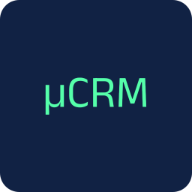
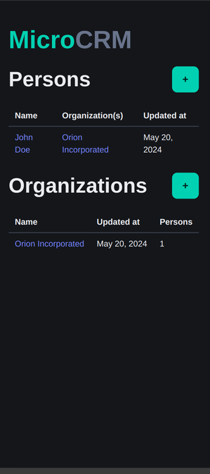
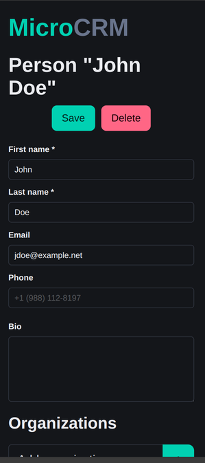

<p align="center">
   
</p>

# MicroCRM (P7 - Développeur Full-Stack - Java et Angular - Mettez en œuvre l'intégration et le déploiement continu d'une application Full-Stack)

MicroCRM est une application de démonstration basique ayant pour être objectif de servir de socle pour le module "P7 - Développeur Full-Stack".

L'application MicroCRM est une implémentation simplifiée d'un ["CRM" (Customer Relationship Management)](https://fr.wikipedia.org/wiki/Gestion_de_la_relation_client). Les fonctionnalités sont limitées à la création, édition et la visualisations des individus liés à des organisations.




## Code source

### Organisation

Ce [monorepo](https://en.wikipedia.org/wiki/Monorepo) contient les 2 composantes du projet "MicroCRM":

- La partie serveur (ou "backend"), en Java SpringBoot 3;
- La partie cliente (ou "frontend"), en Angular 17.

### Démarrer avec les sources

#### Serveur

##### Dépendances

- [OpenJDK >= 17](https://openjdk.org/)

##### Procédure

1. Se positionner dans le répertoire `back` avec une invite de commande:

   ```shell
   cd back
   ```

2. Construire le JAR:

   ```shell
   # Sur Linux
   ./gradlew build

   # Sur Windows
   gradlew.bat build
   ```

3. Démarrer le service:

   ```shell
   java -jar build/libs/microcrm-0.0.1-SNAPSHOT.jar
   ```

Puis ouvrir l'URL http://localhost:8080 dans votre navigateur.

#### Client

##### Dépendances

- [NPM >= 10.2.4](https://www.npmjs.com/)

##### Procédure

1. Se positionner dans le répertoire `front` avec une invite de commande:

   ```shell
   cd front
   ```

2. (La première fois seulement) Installer les dépendances NodeJS:

   ```shell
   npm install
   ```

3. Démarrer le service de développement:

   ```shell
   npx @angular/cli serve
   ```

Puis ouvrir l'URL http://localhost:4200 dans votre navigateur.

### Exécution des tests

#### Client

**Dépendances**

- Google Chrome ou Chromium

Dans votre terminal:

```shell
cd front
CHROME_BIN=</path/to/google/chrome> npm test
```

#### Serveur

Dans votre terminal:

```shell
cd back
./gradlew test
```

### Images Docker

#### Client

##### Construire l'image

```shell
docker build --target front -t orion-microcrm-front:latest .
```

##### Exécuter l'image

```shell
docker run -it --rm -p 80:80 -p 443:443 orion-microcrm-front:latest
```

L'application sera disponible sur https://localhost.

#### Serveur

##### Construire l'image

```shell
docker build --target back -t orion-microcrm-back:latest .
```

##### Exécuter l'image

```shell
docker run -it --rm -p 8080:8080 orion-microcrm-back:latest
```

L'API sera disponible sur http://localhost:8080.

#### Tout en un

```shell
docker build --target standalone -t orion-microcrm-standalone:latest .
```

##### Exécuter l'image

```shell
docker run -it --rm -p 8080:8080 -p 80:80 -p 443:443 orion-microcrm-standalone:latest
```

L'application sera disponible sur https://localhost et l'API sur http://localhost:8080.

### Docker Compose

L'application peut être lancée avec Docker Compose (backend, frontend et nginx en tant que reverse proxy).

#### Configuration (.env)

Copiez `.env.example` vers `.env` et adaptez les valeurs :

```shell
cp .env.example .env
```

| Variable | Description | Défaut |
|----------|-------------|--------|
| `SPRING_APP_NAME` | Nom de l'application Spring Boot | `microcrm` |
| `APP_PORT` | Port HTTP exposé par nginx (base) | `80` |
| `APP_HTTP_PORT` | Port HTTP pour redirect (dev/prod) | `80` |
| `APP_PORT` (dev/prod) | Port HTTPS exposé | `443` |
| `DOCKER_NETWORK` | Nom du réseau Docker | `orion-microcrm_network` |
| `DOCKER_NETWORK_EXTERNAL` | `true` si le réseau existe déjà (multi-apps) | `false` |
| `SSL_CERT_PATH` | Chemin du certificat SSL (prod) | — |
| `SSL_KEY_PATH` | Chemin de la clé privée SSL (prod) | — |

#### Lancer l'application

**Base (HTTP seul) :**

```shell
docker compose up -d
```

**Dev (SSL auto-signé, microcrm.local) :**

```shell
./misc/docker/generate-dev-certs.sh
docker compose -f docker-compose.yml -f docker-compose.dev.yml up -d
```

Ajoutez à `/etc/hosts` : `127.0.0.1 microcrm.local`

**Prod (domaine réel, certificats SSL) :**

```shell
# Définir SSL_CERT_PATH et SSL_KEY_PATH dans .env
docker compose -f docker-compose.yml -f docker-compose.prod.yml up -d
```

**Derrière un reverse proxy externe (Traefik, Caddy) :**

```shell
docker network create orion-microcrm_network
# Dans .env : DOCKER_NETWORK=orion-microcrm_network, DOCKER_NETWORK_EXTERNAL=true
docker compose -f docker-compose.yml -f docker-compose.prod.yml -f docker-compose.proxy.yml up -d
```
