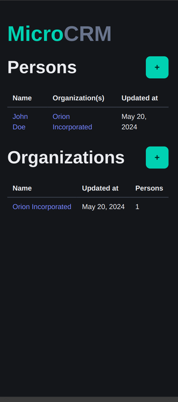

<p align="center">
   
</p>

# MicroCRM (P7 - Développeur Full-Stack - Java et Angular - Mettez en œuvre l'intégration et le déploiement continu d'une application Full-Stack)

MicroCRM est une application de démonstration basique ayant pour objectif de servir de socle pour le module "P7 - Développeur Full-Stack".

L'application MicroCRM est une implémentation simplifiée d'un ["CRM" (Customer Relationship Management)](https://fr.wikipedia.org/wiki/Gestion_de_la_relation_client). Les fonctionnalités sont limitées à la création, édition et la visualisation des individus liés à des organisations.




## Choix techniques

| Composant | Choix | Justification |
|-----------|-------|---------------|
| **CI/CD** | GitHub Actions | Intégration native, workflows YAML, gratuit pour dépôts publics |
| **Workflows** | CI → Release → Docker Image | Chaînage : tests + SonarQube, versioning (semantic-release), build/push images GHCR, déploiement SSH |
| **Conteneurisation** | Docker + Docker Compose | Back (Temurin 17), front (Caddy), nginx (reverse proxy). Multi-stage build, utilisateur non-root. |
| **Qualité** | SonarQube Cloud | Analyse statique back/front, Quality Gate, détection vulnérabilités |
| **Monitoring** | Stack ELK | Logs nginx, backend, GitHub Actions → Kibana (dashboards, métriques DORA) |
| **Release** | semantic-release | Versioning automatique (Conventional Commits), CHANGELOG, tags GitHub |

Détails : [docs/docker.md](docs/docker.md), [docs/ci-setup.md](docs/ci-setup.md), [docs/cd-setup.md](docs/cd-setup.md).

## Code source

### Organisation

Ce [monorepo](https://en.wikipedia.org/wiki/Monorepo) contient les 2 composantes du projet "MicroCRM":

- La partie serveur (ou "backend"), en Java SpringBoot 3;
- La partie cliente (ou "frontend"), en Angular 17.

### Démarrer avec les sources

#### Serveur

##### Dépendances

- [OpenJDK >= 17](https://openjdk.org/)

##### Procédure

1. Se positionner dans le répertoire `back` avec une invite de commande:

   ```shell
   cd back
   ```

2. Construire le JAR:

   ```shell
   # Sur Linux
   ./gradlew build

   # Sur Windows
   gradlew.bat build
   ```

3. Démarrer le service:

   ```shell
   java -jar build/libs/microcrm-0.0.1-SNAPSHOT.jar
   ```

Puis ouvrir l'URL http://localhost:8080 dans votre navigateur.

#### Client

##### Dépendances

- [NPM >= 10.2.4](https://www.npmjs.com/)

##### Procédure

1. Se positionner dans le répertoire `front` avec une invite de commande:

   ```shell
   cd front
   ```

2. (La première fois seulement) Installer les dépendances NodeJS:

   ```shell
   npm install
   ```

3. Démarrer le service de développement:

   ```shell
   npx @angular/cli serve
   ```

Puis ouvrir l'URL http://localhost:4200 dans votre navigateur.

### Exécution des tests

**Script unifié** (depuis la racine du projet) :

```shell
./misc/cicd/run-tests.sh angular    # Tests frontend
./misc/cicd/run-tests.sh springboot # Tests backend
./misc/cicd/run-tests.sh all        # Les deux
```

#### Client

**Dépendances** : Google Chrome ou Chromium

```shell
cd front
npm test
```

#### Serveur

```shell
cd back
./gradlew test
```

### Images Docker

**Docker Compose** utilise les Dockerfiles dédiés (`back/Dockerfile`, `front/Dockerfile`). Pour construire l'ensemble :

```shell
docker compose build
```

**Build manuel** (Dockerfiles dédiés) :

| Service | Construire | Exécuter |
|---------|------------|----------|
| Front | `docker build -f front/Dockerfile -t orion-microcrm-front:latest .` | `docker run -it --rm -p 80:80 orion-microcrm-front:latest` |
| Back | `docker build -f back/Dockerfile -t orion-microcrm-back:latest .` | `docker run -it --rm -p 8080:8080 orion-microcrm-back:latest` |

**Recommandé** : utiliser `docker compose up -d` pour lancer l'application complète (back + front + nginx).

### Docker Compose

L'application peut être lancée avec Docker Compose (backend, frontend et nginx en tant que reverse proxy). Pour les choix techniques et les bonnes pratiques de sécurité, voir [docs/docker.md](docs/docker.md).

#### Configuration (.env)

Copiez `.env.example` vers `.env` et adaptez les valeurs :

```shell
cp .env.example .env
```

| Variable | Description | Défaut |
|----------|-------------|--------|
| `SPRING_APP_NAME` | Nom de l'application Spring Boot | `microcrm` |
| `APP_PORT` | Port HTTP exposé par nginx | `80` |
| `DOCKER_NETWORK` | Nom du réseau Docker | `orion-microcrm_network` |
| `DOCKER_NETWORK_EXTERNAL` | `true` si le réseau existe déjà (multi-apps) | `false` |

#### Lancer l'application

| Mode | Commande | Accès |
|------|----------|-------|
| **Base** | `docker compose up -d` | http://localhost |
| **Dev** (port personnalisable) | `docker compose -f docker-compose.yml -f docker-compose.dev.yml up -d` | http://localhost |
| **Production** (images GHCR) | `docker compose -f docker-compose.yml -f docker-compose.prod.yml up -d --no-build` | Selon config Nginx |
| **Prod via script** | `./misc/cicd/prod-up.sh` ou `--app-only` / `--elk-only` | Voir [docs/prod-deploy.md](docs/prod-deploy.md) |

**Prérequis production** : `docker login ghcr.io` (token avec `read:packages`).

#### Pipeline CI/CD (workflows GitHub Actions)

| Workflow | Fichier | Rôle |
|----------|---------|------|
| **CI** | [ci.yml](.github/workflows/ci.yml) | Tests back/front, build, SonarQube — sur push et PR |
| **Release** | [release.yml](.github/workflows/release.yml) | Versioning (semantic-release), CHANGELOG — après CI sur `main` |
| **Docker Image** | [docker-image.yml](.github/workflows/docker-image.yml) | Build/push images GHCR, déploiement SSH — après Release |

Configuration : [docs/ci-setup.md](docs/ci-setup.md), [docs/cd-setup.md](docs/cd-setup.md), [docs/release-workflow.md](docs/release-workflow.md).
